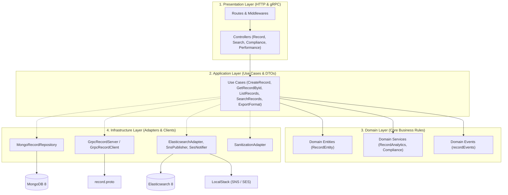
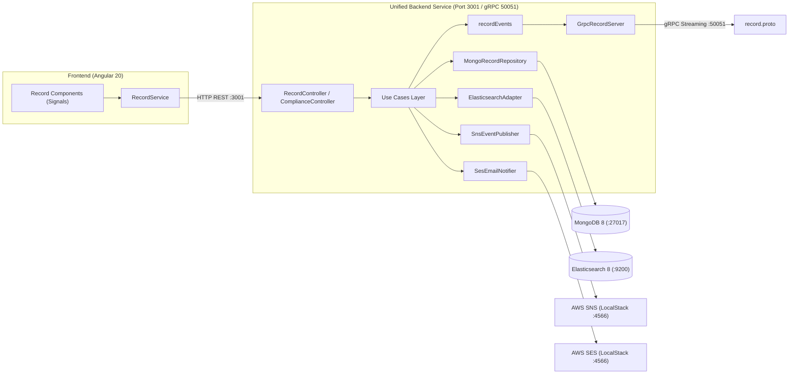

# Demo_Stack — Reference Platform Stack & Metrics Testbed

A reference platform stack and testing benchmark architected with **Enterprise Clean Architecture / Domain-Driven Design (DDD)** and validated against the **Testable Engineering Strategy Matrix (v0.2)**.

---

## 🛠 Technology Stack Configuration

| Layer / Service | Technology | Version | Bundler / Tooling | Role / Port |
| :--- | :--- | :--- | :--- | :--- |
| **Frontend** | **Angular** | `20.3.0` | **esbuild** (`@angular/build`) + npm | Angular 20 SPA with Signals, Biome 2.5.9, ESLint (`:4200`) |
| **Unified Backend** | **Node.js / Express** | `22.0+` | Clean Architecture (DDD) + CommonJS | REST API (`:3001`), gRPC Server (`:50051`), Mongoose 8, Elasticsearch 8, AWS SDK |
| **Data Layer 1** | **MongoDB** | `8.0` | `mongo:8` (Docker) | Primary persistent document store (`:27017`) |
| **Data Layer 2** | **Elasticsearch** | `8.15.3` | Docker (`docker.elastic.co`) | Search & analytics engine (`:9200`) |
| **Messaging / Eventing**| **gRPC** | `1.11.3` | `@grpc/grpc-js` + `@grpc/proto-loader` | Server-streaming RPC contract (`shared/proto/record.proto`) |
| **Cloud Services** | **LocalStack (AWS)** | `3.0` | `localstack/localstack:3` (Docker)| Emulates AWS SNS, SES, SQS (`:4566`) |

---

## 🏛 Backend Enterprise Architecture (Clean Architecture / DDD)

The unified backend service is organized into decoupled, enterprise-grade layers following Clean / Hexagonal Architecture:



### Architectural Layering Rules:
1. **`domain/`**: Houses pure business logic, domain entities (`RecordEntity`), domain events (`recordEvents`), and domain rules (e.g. $O(n^3)$ Big-O complexity algorithms, GDPR/FERPA/COPPA/HIPAA/PCI-DSS compliance rules), completely decoupled from web frameworks or databases.
2. **`application/`**: Encapsulates discrete Use Cases (`CreateRecordUseCase`, `GetRecordByIdUseCase`, `ListRecordsUseCase`, `SearchRecordsUseCase`, `ExportFormatUseCase`) and Data Transfer Objects (DTOs).
3. **`infrastructure/`**: Concrete implementations and technical adapters (Mongoose repository with in-memory fallback, gRPC server & client, Elasticsearch client, AWS SNS/SES clients, SAST input sanitization).
4. **`presentation/`**: HTTP controllers, route dispatchers, security headers middleware (HSTS, CSP, X-Frame-Options), clean error handlers (no 500 stack trace leak), and gRPC event listeners.
5. **`config/`**: Centralized environment variable validation and runtime constants (`env.config.js`).

---

## 📐 End-to-End System Architecture



---

## 📊 Strategy & Metrics Pass Data (Testable Strategy v0.2)

### 1. Structural & Complexity Analysis
* **Cyclomatic & Cognitive Complexity:** Triply nested loops for $O(n^3)$ Big-O detection, decision branches, switch cases, and DU-pairs (`RecordAnalyticsDomainService.js`, `record-analytics.ts`).
* **Code Duplication & Clones:** Export transformers (JSON, CSV, XML) for `jscpd` and SonarJS clone detection (`ExportFormatUseCase.js`, `export-format.ts`, `export-format-legacy.ts`).
* **Data Flow Testing:** Variable definition-use mapping (All-Defs, C-Use computations, P-Use predicate branch decisions).

### 2. Static Application Security (SAST) & Supply Chain (SCA)
* **SAST:** Input sanitization (`SanitizationAdapter.escapeHtml`), safe path traversal (`SanitizationAdapter.sanitizeFilePath`), regex escaping (`SanitizationAdapter.escapeRegex`), parameterized queries.
* **SCA:** Multi-tier dependency trees in lockfiles (`package-lock.json`), license compliance metadata (`license-checker`), vulnerability databases (`cve-lite-cli`, `npm audit`).

### 3. Compliance & Governance
* **GDPR:** Privacy Notice endpoint (`GET /api/compliance/privacy`), DSAR export (`GET /api/compliance/gdpr/export/:userId`), Right to Erasure (`DELETE /api/compliance/gdpr/erase/:userId`).
* **FERPA & COPPA (EdTech):** Under-13 parental consent verification (`POST /api/compliance/coppa/verify-consent`), student PII redaction (`POST /api/compliance/ferpa/redact-student`).
* **PCI-DSS (Retail):** Primary Account Number (PAN) masking (`POST /api/compliance/pci/mask-pan`).
* **HIPAA (Health):** Electronic Protected Health Information sanitization (`POST /api/compliance/hipaa/sanitize-ephi`).
* **SOC 2 & Secrets:** Audit logging endpoint (`GET /api/compliance/soc2/audit-logs`), `.gitleaks.toml` secret scanning rules, and `.github/pull_request_template.md` peer-review checklist.

### 4. Performance & Reliability Testing
* **Static Anti-Patterns:** ORM N+1 query loop modeling (`GET /api/performance/n-plus-one`), memory allocation inside loops (`GET /api/performance/memory-telemetry`), bundle size tracking.
* **Dynamic Telemetry:** Soak memory/CPU telemetry (`GET /api/performance/soak`), spike recovery simulation (`GET /api/performance/spike`), cache hit rate telemetry (`GET /api/performance/cache-stats`).
* **K6 Load Testing:** Dynamic load test script (`perf/k6-load-test.js`) evaluating throughput (RPS), p95/p99 tail latency, 4xx/5xx error rates, and virtual users concurrency (up to 100 VU).

---

## 🚀 Run & Verification Commands

### 1. Infrastructure
```bash
docker-compose up -d
```

### 2. Unified Backend Service (Clean Architecture)
```bash
cd backend
npm install
npm run check       # Syntax & require check (node -c src/server.js)
npm test            # Mocha unit & integration test suite
npm run coverage    # Cobertura XML & Istanbul coverage report
npm start           # Starts HTTP :3001 and gRPC :50051
```

### 3. Frontend (Angular 20 SPA)
```bash
cd ../frontend
npm install
npm run lint:biome  # Biome check
npx ng build        # Builds production bundle
npm start           # Starts Angular SPA on :4200
```

### 4. Dynamic K6 Performance Testing
```bash
k6 run perf/k6-load-test.js
```