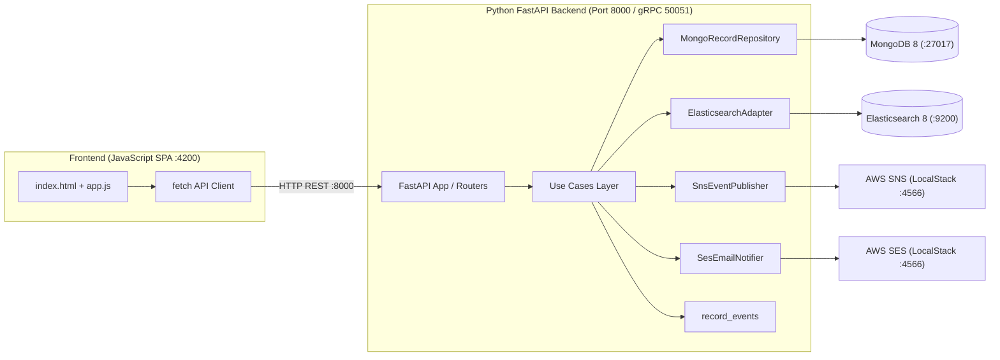

# Demo_Stack — Python + JavaScript Reference Platform Stack

A reference platform stack combining a **Python (FastAPI Clean Architecture / DDD)** backend with a **JavaScript Single Page Application (SPA)** frontend, validated against the **Testable Engineering Strategy Matrix (v0.2)**.

---

## 🛠 Technology Stack Configuration

| Layer / Service | Technology | Version | Tooling | Role / Port |
| :--- | :--- | :--- | :--- | :--- |
| **Frontend** | **JavaScript SPA** | `ES2022+` | HTML5 + Modern JavaScript + Express | Client application UI (`:4200`) |
| **Unified Backend** | **Python (FastAPI / Uvicorn)** | `3.12+` | Clean Architecture (DDD) + Pydantic v2 | REST API (`:8000`), gRPC Server (`:50051`), PyMongo 4, Elasticsearch, AWS Boto3 |
| **Data Layer 1** | **MongoDB** | `8.0` | `mongo:8` (Docker) | Primary persistent document store (`:27017`) |
| **Data Layer 2** | **Elasticsearch** | `8.15.3` | Docker (`docker.elastic.co`) | Search & analytics engine (`:9200`) |
| **Messaging / Eventing**| **gRPC** | `1.66+` | `grpcio` + `grpcio-tools` | Server-streaming RPC contract (`shared/proto/record.proto`) |
| **Cloud Services** | **LocalStack (AWS)** | `3.0` | `localstack/localstack:3` (Docker)| Emulates AWS SNS, SES, SQS (`:4566`) |

---

## 📐 End-to-End System Architecture



---

## 🚀 Run & Verification Commands

### 1. Run Python Backend Tests & Server
```bash
cd backend
uv run pytest
uv run uvicorn app.main:app --host 0.0.0.0 --port 8000 --reload
```

### 2. Run JavaScript Frontend Client
```bash
cd frontend
npm install
npm start # Starts on http://localhost:4200
```