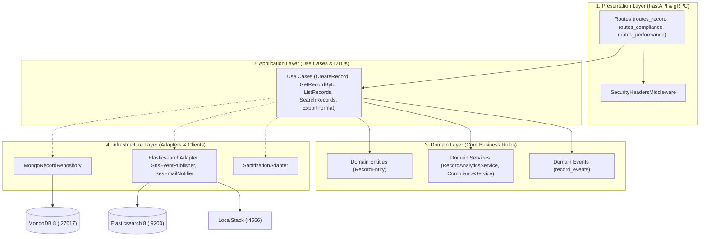

# Demo_Stack — Pure Python Reference Platform Stack & Metrics Testbed

A reference platform stack and testing benchmark architected with **Python Enterprise Clean Architecture / Domain-Driven Design (DDD)** and validated against the **Testable Engineering Strategy Matrix (v0.2)**.

---

## 🛠 Technology Stack Configuration

| Layer / Service | Technology | Version | Tooling | Role / Port |
| :--- | :--- | :--- | :--- | :--- |
| **Unified Backend** | **Python (FastAPI / Uvicorn)** | `3.12+ / 3.13+` | Clean Architecture (DDD) + Pydantic v2 | REST API (`:8000`), gRPC Server (`:50051`), PyMongo 4, Elasticsearch, AWS Boto3 |
| **Client / CLI** | **Python CLI** | `3.12+` | `httpx` + `argparse` | CLI administration client (`client/cli.py`) |
| **Data Layer 1** | **MongoDB** | `8.0` | `mongo:8` (Docker) | Primary persistent document store (`:27017`) |
| **Data Layer 2** | **Elasticsearch** | `8.15.3` | Docker (`docker.elastic.co`) | Search & analytics engine (`:9200`) |
| **Messaging / Eventing**| **gRPC** | `1.66+` | `grpcio` + `grpcio-tools` | Server-streaming RPC contract (`shared/proto/record.proto`) |
| **Cloud Services** | **LocalStack (AWS)** | `3.0` | `localstack/localstack:3` (Docker)| Emulates AWS SNS, SES, SQS (`:4566`) |

---

## 🏛 Clean Architecture Directory Structure



---

## 🚀 Run & Verification Commands

### 1. Run Tests & Coverage
```bash
cd backend
uv run pytest
```

### 2. Start Backend Server
```bash
cd backend
uv run uvicorn app.main:app --host 0.0.0.0 --port 8000 --reload
```

### 3. Run Python CLI
```bash
python client/cli.py health
python client/cli.py list
python client/cli.py create --title "My Record" --description "Created via CLI"
```